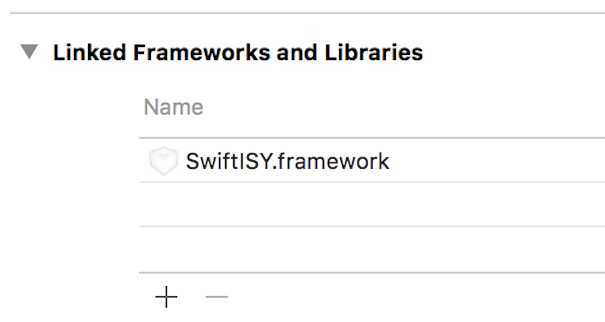

# SwiftISY

[]()
[]()
[](https://github.com/Carthage/Carthage)
[]()

__SwiftISY__ is a framework to interact with the 
[Universal Devices ISY-994i Series](https://www.universal-devices.com/residential/isy994i-series/) 
product written in Swift.  This home automation solution supports remote access by a 
[REST interface](http://wiki.universal-devices.com/index.php?title=ISY_Developers:API:REST_Interface).

For additional developer information, refer to the 
[developer's website](http://www.universal-devices.com/isy-developers/).

- __Requirements__: iOS 9 or later
- __Swift Version__: Swift 3.0.1

Please note that not all REST features are currently supported by this framework.  This framework
currently supports:

* Lookup of lighting devices.
* Lookup of lighting scenes.
* Get status of lighting devices.
* Turn on a device/scene.
* Turn off a device/scene.

Additional functionality will be added in the future.

## Usage

```swift
import SwiftISY

// create a request
let request = SwiftISYRequest(SwiftISYHost(host: "your host", user: "your username", password: "your password"))

// get all nodes for this host
request.nodes { (results) in
  if let objects = results.objects {
    // loop through all devices on this host
    for node in objects.nodes {
      // process this device
      ...

      // get status for this device
      let status = objects.statuses[node.address]
      ...
    }

    // loop through all scenes on this host
    for node in objects.groups {
      // process this scene
      ...
    }
  }
}

```

## Installation

1. Build SwiftISY framework.
3. In *Build Phases*, add `SwiftISY.framework` library to your project.
<br />
5. `import SwiftISY` in your Swift file.
6. Use in your code.

### Build via Carthage
SwiftISY is [Carthage](https://github.com/Carthage/Carthage) compatible. You can easily build 
SwiftISY by adding the following line to your Cartfile.

```ruby
github "wyzzarz/SwiftISY"
```

To install the framework, run `carthage update --platform iOS`

## Author

Copyright 2017 Warner Zee.

## License

SwiftISY is available under the Apache License, Version 2.0. See the [LICENSE](LICENSE) file for more info.
