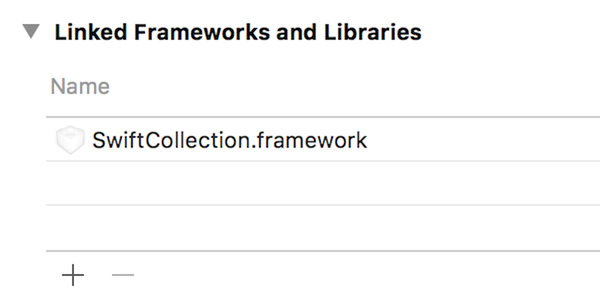

# SwiftCollection

[]()
[]()
[](https://github.com/Carthage/Carthage)
[]()

__SwiftCollection__ is a framework written in Swift that provides a collection for documents that 
can be persisted to physical storage.

A limitation of Swift arrays and dictionaries is that additional properties to store values
cannot be added.  This barrier makes it cumbersome to employ these collections for complex data
structures.

This framework introduces `SCDocumentProtocol`, `SCDocument` and `SCOrderedSet`.  Documents provide
unique storage for complex data structures by primary key.  Ordered set provides fast access to
documents while maintaining a sort order for enumeration and display.

Documents adopt the `SCDocumentProtocol` protocol.  A concrete implementation of this protocol is
the `SCDocument` class.  Application using this framework can subclass `SCDocument` and provide
any necessary properties and functions.

The collection is a sorted set `SCOrderedSet`.  Elements in this collection adhere to the
`SCDocumentProtocol` protocol.

The collection and documents can be persisted to physical storage.  A JSON serialized string will
be used for storage when saving and loading.  Persistence currently supports `UserDefaults`, however
additional storage options will be added in the future.

Serialization to JSON leverages reflection to capture properties by name and their values.  Certain
types (such as enums) need to be handled by application that implement this framework.  While other
types (such as sets) and tuples are stored as an array.  Applications can provide their own
serialization logic.

Currently, serialization from JSON needs to be handled by the application.  Swift is a typed language
where many types (such as Int) cannot be set by KVO.  Applications can provide their own logic to
extract and load data from JSON.

- __Requirements__: iOS 9 or later
- __Swift Version__: Swift 3.0.1

## Usage

```swift
import SwiftCollection

/// `Document` sublcasses `SCDocument` and provides an additional field `name`.
///
/// Loading from persistent storage is updated for the `name` field.
class Document: SCDocument {

  var name: String?

  convenience init(id: SwiftCollection.Id, name: String) {
    self.init(id: id)
    self.name = name
  }

  override func load(propertyWithName name: String, currentValue: Any, potentialValue: Any, json: AnyObject) {
    switch name {
    case Keys.name: if let value = (json as? [String: Any])?[Keys.name] as? String { self.name = value }
    default: super.load(propertyWithName: name, currentValue: currentValue, potentialValue: potentialValue, json: json)
    }
  }

}

extension Document.Keys {

  static let name = "name"

}

/// `OrderedSet` provides a concrete implementation of `SCOrderedSet` for a collection of `Document`
/// objects.
///
/// A new persistent storage key is provided.  And loading from persistent storage is performed
/// for documents in the collection.
class OrderedSet: SCOrderedSet<Document> {

  func storageKey() -> String {
    return "OrderedSetExample"
  }

  public func load(jsonObject json: AnyObject) throws -> AnyObject? {
    if let array = json as? [AnyObject] {
      for item in array {
        try? append(document: Document(json: item))
      }
    }
    return json
  }

}

// create a new ordered set
let orderedSet = OrderedSet()

// add documents to the collection
try? orderedSet.append(document: Document(id: 1, name: "First"))
try? orderedSet.append(document: Document(id: 2, name: "Second"))
try? orderedSet.append(document: Document(id: 3, name: "Third"))

// example to save the collection to persistent storage.  And load saved data from persistent
// storage.
try? orderedSet.save(jsonStorage: .userDefaults) { (success) in
  print("saved", success)
  var anotherOrderedSet = OrderedSet()
  try? anotherOrderedSet.load(jsonStorage: .userDefaults) { (success, json) in
    print("loaded", success)
  }
}

```

## Installation

1. Build SwiftCollection framework.
3. In *Build Phases*, add `SwiftCollection.framework` library to your project.
<br />
5. `import SwiftCollection` in your Swift file.
6. Use in your code.

### Build via Carthage
SwiftCollection is [Carthage](https://github.com/Carthage/Carthage) compatible. You can easily build 
SwiftCollection by adding the following line to your Cartfile.

```ruby
github "wyzzarz/SwiftCollection"
```

To install the framework, run `carthage update --platform iOS`

## Author

Copyright 2017 Warner Zee.

## License

SwiftCollection is available under the Apache License, Version 2.0. See the [LICENSE](LICENSE) file for more info.
